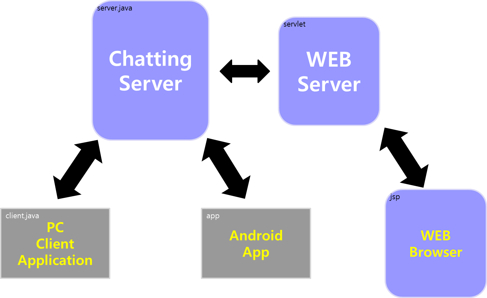

# MulChat : Team1

This Repository is for chatting program called MulChat

## I. Contents

- ChattingServer & Client Application : [ChattingServer](/chattingserver)
  - Client.java
  - Server.java
- Web Server & Web Browser : [test](/test)
  - ChatServlet.java
  - chat.jsp
- Android App : [WebServerSocketExersice](/webserversocketexersice)
  - MainActivity

## II. Functions

- ChattingServer
  - Client.java
    - Sender : The function that can send the message to server
    - Receiver : The function that can receive the message from server

  

  - Server.java
    - Sender
      - sendMsg : The function that can send the message to all client
      - sendMsgToTarget : The function that can send the message to the client
    - Receiver : The function that can receive the message from clients

- test

  - ChatServlet.java : The function that can get the message from web and send the message to server
    - Client.java

  

  - chat.jsp : The function that can send the message to server

- WebServerSocketExersice
  - MainActivity : The function that can send the message to server and get the message from server